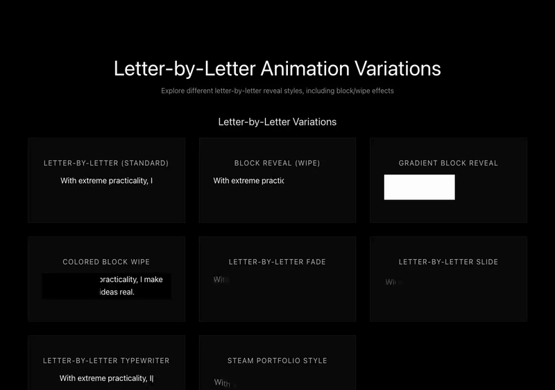

# Animation Sandbox

A standalone React application for previewing and testing text reveal animations. This sandbox provides 17 different animation variations, with a focus on letter-by-letter reveal effects.



## Features

- **17 Animation Variations**: Letter-by-letter, word-by-word, and other text reveal effects
- **Interactive Preview**: Click any animation card to select it
- **Minimalist Dark Theme**: Clean, modern interface
- **Reusable Components**: Copy animation components directly into your projects

## Getting Started

```bash
# Install dependencies
npm install

# Start development server
npm run dev

# Build for production
npm run build
```

## Animation Types

### Letter-by-Letter Variations (8 types)
1. **Letter-by-Letter (Standard)** - Basic character-by-character reveal
2. **Block Reveal (Wipe)** - Text revealed as a block moves across
3. **Gradient Block Reveal** - Gradient mask sweeps to reveal text
4. **Colored Block Wipe** - Colored block covers text and moves left to right
5. **Letter-by-Letter Fade** - Each letter fades in individually
6. **Letter-by-Letter Slide** - Each letter slides up as it appears
7. **Letter-by-Letter Typewriter** - Typewriter effect with cursor
8. **Steam Portfolio Style** - Smooth letter reveal with slide-up effect (inspired by steam-portfolio-demo.vercel.app)

### Other Animations (9 types)
- Word-by-Word Fade
- Gradient Sweep
- Word Slide Up
- Blur to Clear
- Scale Words
- Typewriter
- Line-by-Line
- Staggered Fade
- Split Reveal

## Usage

1. Run the development server: `npm run dev`
2. Browse animations in the sandbox
3. Click on any animation card to select it
4. Copy the component code from `src/components/AnimationSandbox.tsx` to use in your projects

## Project Structure

```
animation-sandbox/
├── src/
│   ├── components/
│   │   └── AnimationSandbox.tsx  # All animation components and sandbox UI
│   ├── App.tsx
│   └── index.css
├── package.json
└── README.md
```

## Technologies

- **React 19** with **TypeScript**
- **Vite** for fast development and building
- No external dependencies (pure React + CSS)

## Customization

Each animation component accepts:
- `text: string` - The text to animate
- `speed?: number` - Animation speed in milliseconds (optional)

Modify the sample text or add new animation variations in `AnimationSandbox.tsx`.
